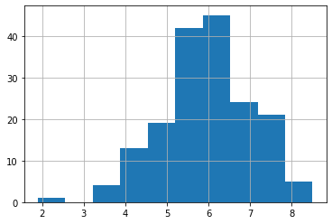

I saw that YouTube had [a wide selection of movies](https://www.youtube.com/movies), but the free movies didn't seem very good. Was interested in seeing what kind of ratings the free movies on YouTube receive. Let's figure it out!

## Go to the Movies

To start, let's import some things.


```python
import pandas as pd
import requests
from bs4 import BeautifulSoup

import seaborn as sns
import matplotlib.pyplot as plt
```

We can use `requests` to grab the html.


```python
url = 'https://www.youtube.com/feed/storefront?bp=kgEmCGQSIlBMSFBUeFR4dEMwaWJWWnJUMl9XS1dVbDJTQXhzS3VLd3iiBQIoAg%3D%3D'
page = requests.get(url)

```


```python
soup = BeautifulSoup(page.text, 'html.parser')
```


```python
print(soup.prettify()[:200])

```

    <!DOCTYPE html>
    <html data-cast-api-enabled="true" lang="en">
     <head>
      <style name="www-roboto">
       @font-face{font-family:'Roboto';font-style:normal;font-weight:500;src:local('Roboto Medium'),local(


At this point, we can do some inspecting to find that each film has a `yt-lockup-title` class that we can access. With a little bit of fiddling, we can get a dataframe of the movie names. There is also a common format which we can use to split the strings into separate columns.


```python
html_films = soup.find_all(class_="yt-lockup-title")

for film in html_films[:5]:
    print(film.get_text())
```

    Dino King - Duration: 1:28:47.
    Snow Queen - Duration: 1:16:07.
    Beyond Beyond - Duration: 1:19:24.
    Igor (U.S) - Duration: 1:26:31.
    Sleepover - Duration: 1:29:29.


```python
movies = [film.get_text() for film in html_films]
```


```python
movies[:6]
```


    ['Dino King - Duration: 1:28:47.',
     'Snow Queen - Duration: 1:16:07.',
     'Beyond Beyond - Duration: 1:19:24.',
     'Igor (U.S) - Duration: 1:26:31.',
     'Sleepover - Duration: 1:29:29.',
     'The Secret of Nimh - Duration: 1:22:46.']


```python
df = pd.DataFrame(movies)
df.rename(columns={0: 'movie'}, inplace=True)
```


```python
df[df.movie.str.contains(' - Duration: ')].head()
```


<div>
<style scoped>
    .dataframe tbody tr th:only-of-type {
        vertical-align: middle;
    }

    .dataframe tbody tr th {
        vertical-align: top;
    }

    .dataframe thead th {
        text-align: right;
    }
</style>
<table border="1" class="dataframe">
  <thead>
    <tr style="text-align: right;">
      <th></th>
      <th>movie</th>
    </tr>
  </thead>
  <tbody>
    <tr>
      <th>0</th>
      <td>Dino King - Duration: 1:28:47.</td>
    </tr>
    <tr>
      <th>1</th>
      <td>Snow Queen - Duration: 1:16:07.</td>
    </tr>
    <tr>
      <th>2</th>
      <td>Beyond Beyond - Duration: 1:19:24.</td>
    </tr>
    <tr>
      <th>3</th>
      <td>Igor (U.S) - Duration: 1:26:31.</td>
    </tr>
    <tr>
      <th>4</th>
      <td>Sleepover - Duration: 1:29:29.</td>
    </tr>
  </tbody>
</table>
</div>


```python
df = df.movie.str.split(' - Duration: ', expand=True)
```


```python
df[1] = df[1].str.rstrip('.')
```


```python
df = df.reset_index()
```


```python
df.rename(columns={0: 'yt_title', 1: 'yt_duration', 'index': 'yt_id'}, inplace=True)
```


```python
df.head()
```


<div>
<style scoped>
    .dataframe tbody tr th:only-of-type {
        vertical-align: middle;
    }

    .dataframe tbody tr th {
        vertical-align: top;
    }

    .dataframe thead th {
        text-align: right;
    }
</style>
<table border="1" class="dataframe">
  <thead>
    <tr style="text-align: right;">
      <th></th>
      <th>yt_id</th>
      <th>yt_title</th>
      <th>yt_duration</th>
    </tr>
  </thead>
  <tbody>
    <tr>
      <th>0</th>
      <td>0</td>
      <td>Dino King</td>
      <td>1:28:47</td>
    </tr>
    <tr>
      <th>1</th>
      <td>1</td>
      <td>Snow Queen</td>
      <td>1:16:07</td>
    </tr>
    <tr>
      <th>2</th>
      <td>2</td>
      <td>Beyond Beyond</td>
      <td>1:19:24</td>
    </tr>
    <tr>
      <th>3</th>
      <td>3</td>
      <td>Igor (U.S)</td>
      <td>1:26:31</td>
    </tr>
    <tr>
      <th>4</th>
      <td>4</td>
      <td>Sleepover</td>
      <td>1:29:29</td>
    </tr>
  </tbody>
</table>
</div>


### Convert Duration to minutes
The string movie time doesn't mean much to us. Let's turn it into minutes.


```python
def split_time(x):
    numbers = x.split(':')
    time = int(numbers[0]) * 60 + int(numbers[1])
    return time
```


```python
df['yt_minutes'] = df['yt_duration'].apply(split_time)
```

## IMDb Data
- We will use data from the IMDb datasets to get info on the movie ratings.


```python
imdb_ratings = pd.read_csv('/Users/zachbogart/Downloads/title.ratings.tsv', sep='\t')
imdb_basics = pd.read_csv('/Users/zachbogart/Downloads/title.basics.tsv', sep='\t')
```

    /Users/zachbogart/Documents/venv-breadbasket/sourdough_venv/lib/python3.7/site-packages/IPython/core/interactiveshell.py:3058: DtypeWarning: Columns (5) have mixed types.Specify dtype option on import or set low_memory=False.
      interactivity=interactivity, compiler=compiler, result=result)


```python
imdb = imdb_basics.merge(imdb_ratings, how='left', on='tconst')
```


```python
imdb.shape
```


    (6831547, 11)


Let's look just at items that are `movie`s


```python
imdb.titleType.value_counts()
```


    tvEpisode       4869408
    short            741081
    movie            551301
    video            265727
    tvSeries         184466
    tvMovie          121175
    tvMiniSeries      31078
    tvSpecial         29209
    videoGame         25548
    tvShort           12554
    Name: titleType, dtype: int64


```python
imdb = imdb.loc[imdb.titleType == 'movie']
```


```python
imdb.shape
```


    (551301, 11)


```python
imdb.head()
```


<div>
<style scoped>
    .dataframe tbody tr th:only-of-type {
        vertical-align: middle;
    }

    .dataframe tbody tr th {
        vertical-align: top;
    }

    .dataframe thead th {
        text-align: right;
    }
</style>
<table border="1" class="dataframe">
  <thead>
    <tr style="text-align: right;">
      <th></th>
      <th>tconst</th>
      <th>titleType</th>
      <th>primaryTitle</th>
      <th>originalTitle</th>
      <th>isAdult</th>
      <th>startYear</th>
      <th>endYear</th>
      <th>runtimeMinutes</th>
      <th>genres</th>
      <th>averageRating</th>
      <th>numVotes</th>
    </tr>
  </thead>
  <tbody>
    <tr>
      <th>8</th>
      <td>tt0000009</td>
      <td>movie</td>
      <td>Miss Jerry</td>
      <td>Miss Jerry</td>
      <td>0</td>
      <td>1894</td>
      <td>\N</td>
      <td>45</td>
      <td>Romance</td>
      <td>5.9</td>
      <td>153.0</td>
    </tr>
    <tr>
      <th>145</th>
      <td>tt0000147</td>
      <td>movie</td>
      <td>The Corbett-Fitzsimmons Fight</td>
      <td>The Corbett-Fitzsimmons Fight</td>
      <td>0</td>
      <td>1897</td>
      <td>\N</td>
      <td>20</td>
      <td>Documentary,News,Sport</td>
      <td>5.2</td>
      <td>346.0</td>
    </tr>
    <tr>
      <th>332</th>
      <td>tt0000335</td>
      <td>movie</td>
      <td>Soldiers of the Cross</td>
      <td>Soldiers of the Cross</td>
      <td>0</td>
      <td>1900</td>
      <td>\N</td>
      <td>\N</td>
      <td>Biography,Drama</td>
      <td>6.1</td>
      <td>40.0</td>
    </tr>
    <tr>
      <th>499</th>
      <td>tt0000502</td>
      <td>movie</td>
      <td>Bohemios</td>
      <td>Bohemios</td>
      <td>0</td>
      <td>1905</td>
      <td>\N</td>
      <td>100</td>
      <td>\N</td>
      <td>3.8</td>
      <td>6.0</td>
    </tr>
    <tr>
      <th>571</th>
      <td>tt0000574</td>
      <td>movie</td>
      <td>The Story of the Kelly Gang</td>
      <td>The Story of the Kelly Gang</td>
      <td>0</td>
      <td>1906</td>
      <td>\N</td>
      <td>70</td>
      <td>Biography,Crime,Drama</td>
      <td>6.1</td>
      <td>574.0</td>
    </tr>
  </tbody>
</table>
</div>


## Try Joining

We are playing this pretty fast and loose, but we can get a rough sense of the movie ratings using a simple join and dropping any corner cases.


```python
joined = df.merge(imdb, how='left', left_on='yt_title', right_on='primaryTitle')
```


```python
# remove any values with null
joined = joined.dropna().sort_values('primaryTitle')
```

Let's not deal with any overlap. Just the movies that have one match (Could also try to match durations to get more movies, but let's ignore that right now).
- there are a bunch of items with multiple results
- Let's see what we have without trying to dig out overlapping movies


```python
joined.yt_title.value_counts()
```


    Romeo and Juliet      10
    Happily Ever After    10
    Zoo                   10
    The Suspect            8
    Gone                   8
                          ..
    A Cowgirl's Story      1
    Mad Money              1
    Bakery in Brooklyn     1
    Snow Queen             1
    17 Miracles            1
    Name: yt_title, Length: 262, dtype: int64


```python
singles = joined.groupby('yt_title')['yt_title'].filter(lambda x: len(x) == 1)
```


```python
easy = joined[joined.yt_title.isin(singles)]
```

# What Do We Find?

## The Highest (and Lowest) Rated
- What are the top-rated movies available? Worst Rated?


```python
cols = ['yt_title', 'averageRating', 'numVotes']
```


```python
easy[cols].sort_values('averageRating', ascending=False).head(10)
```


<div>
<style scoped>
    .dataframe tbody tr th:only-of-type {
        vertical-align: middle;
    }

    .dataframe tbody tr th {
        vertical-align: top;
    }

    .dataframe thead th {
        text-align: right;
    }
</style>
<table border="1" class="dataframe">
  <thead>
    <tr style="text-align: right;">
      <th></th>
      <th>yt_title</th>
      <th>averageRating</th>
      <th>numVotes</th>
    </tr>
  </thead>
  <tbody>
    <tr>
      <th>478</th>
      <td>The Usual Suspects</td>
      <td>8.5</td>
      <td>956313.0</td>
    </tr>
    <tr>
      <th>429</th>
      <td>Zeitgeist: Moving Forward</td>
      <td>8.2</td>
      <td>17246.0</td>
    </tr>
    <tr>
      <th>440</th>
      <td>Bones Brigade: An Autobiography</td>
      <td>8.1</td>
      <td>2306.0</td>
    </tr>
    <tr>
      <th>433</th>
      <td>Requiem for the American Dream</td>
      <td>8.1</td>
      <td>8297.0</td>
    </tr>
    <tr>
      <th>712</th>
      <td>Citizenfour</td>
      <td>8.0</td>
      <td>50670.0</td>
    </tr>
    <tr>
      <th>413</th>
      <td>Sound City</td>
      <td>7.8</td>
      <td>11887.0</td>
    </tr>
    <tr>
      <th>308</th>
      <td>Muscle Shoals</td>
      <td>7.7</td>
      <td>3400.0</td>
    </tr>
    <tr>
      <th>303</th>
      <td>Fat, Sick &amp; Nearly Dead</td>
      <td>7.5</td>
      <td>8338.0</td>
    </tr>
    <tr>
      <th>272</th>
      <td>The Secret of Roan Inish</td>
      <td>7.5</td>
      <td>6792.0</td>
    </tr>
    <tr>
      <th>319</th>
      <td>Unbranded</td>
      <td>7.4</td>
      <td>1326.0</td>
    </tr>
  </tbody>
</table>
</div>


```python
easy[cols].sort_values('averageRating').head(10)
```


<div>
<style scoped>
    .dataframe tbody tr th:only-of-type {
        vertical-align: middle;
    }

    .dataframe tbody tr th {
        vertical-align: top;
    }

    .dataframe thead th {
        text-align: right;
    }
</style>
<table border="1" class="dataframe">
  <thead>
    <tr style="text-align: right;">
      <th></th>
      <th>yt_title</th>
      <th>averageRating</th>
      <th>numVotes</th>
    </tr>
  </thead>
  <tbody>
    <tr>
      <th>10</th>
      <td>Disaster Movie</td>
      <td>1.9</td>
      <td>85558.0</td>
    </tr>
    <tr>
      <th>636</th>
      <td>Alcatraz</td>
      <td>3.3</td>
      <td>359.0</td>
    </tr>
    <tr>
      <th>169</th>
      <td>Spiders 3D</td>
      <td>3.3</td>
      <td>3960.0</td>
    </tr>
    <tr>
      <th>707</th>
      <td>The Remains</td>
      <td>3.7</td>
      <td>2870.0</td>
    </tr>
    <tr>
      <th>513</th>
      <td>Fist of the Warrior</td>
      <td>3.8</td>
      <td>369.0</td>
    </tr>
    <tr>
      <th>740</th>
      <td>Fishing Naked</td>
      <td>4.0</td>
      <td>782.0</td>
    </tr>
    <tr>
      <th>160</th>
      <td>Ribbit</td>
      <td>4.0</td>
      <td>611.0</td>
    </tr>
    <tr>
      <th>74</th>
      <td>Hollow Creek</td>
      <td>4.2</td>
      <td>592.0</td>
    </tr>
    <tr>
      <th>327</th>
      <td>Arthur &amp; Merlin</td>
      <td>4.3</td>
      <td>1226.0</td>
    </tr>
    <tr>
      <th>611</th>
      <td>Out of Liberty</td>
      <td>4.4</td>
      <td>262.0</td>
    </tr>
  </tbody>
</table>
</div>


## How Old Are These Movies?
- Most are a few years old. Some are decades old.


```python
easy['startYear'] = pd.to_numeric(easy.startYear)
```

    /Users/zachbogart/Documents/venv-breadbasket/sourdough_venv/lib/python3.7/site-packages/ipykernel_launcher.py:1: SettingWithCopyWarning: 
    A value is trying to be set on a copy of a slice from a DataFrame.
    Try using .loc[row_indexer,col_indexer] = value instead
    
    See the caveats in the documentation: https://pandas.pydata.org/pandas-docs/stable/user_guide/indexing.html#returning-a-view-versus-a-copy
      """Entry point for launching an IPython kernel.


```python
ax = sns.relplot(data=easy,
                x='startYear',
                y='averageRating',
                kind='scatter',
                hue='yt_minutes')
plt.show()
```


## Scraping the Bottom of the Barrel
- Looks like the movies are pretty poorly rated, averaging around 6 out of 10


```python
ax = easy.averageRating.hist()
plt.show()
```





```python
print(f"{easy.averageRating.mean():.2f}")
```

    5.95


## Overall
You get what you (don't) pay for.

#### Resources
- https://docs.python-guide.org/scenarios/scrape/
- https://www.digitalocean.com/community/tutorials/how-to-work-with-web-data-using-requests-and-beautiful-soup-with-python-3
- https://www.geeksforgeeks.org/split-a-text-column-into-two-columns-in-pandas-dataframe/


#### Image Credit
integrated system by Zach Bogart from the [Noun Project](https://thenounproject.com/search/?q=integrated%20system&creator=4129988&i=3169228) 
