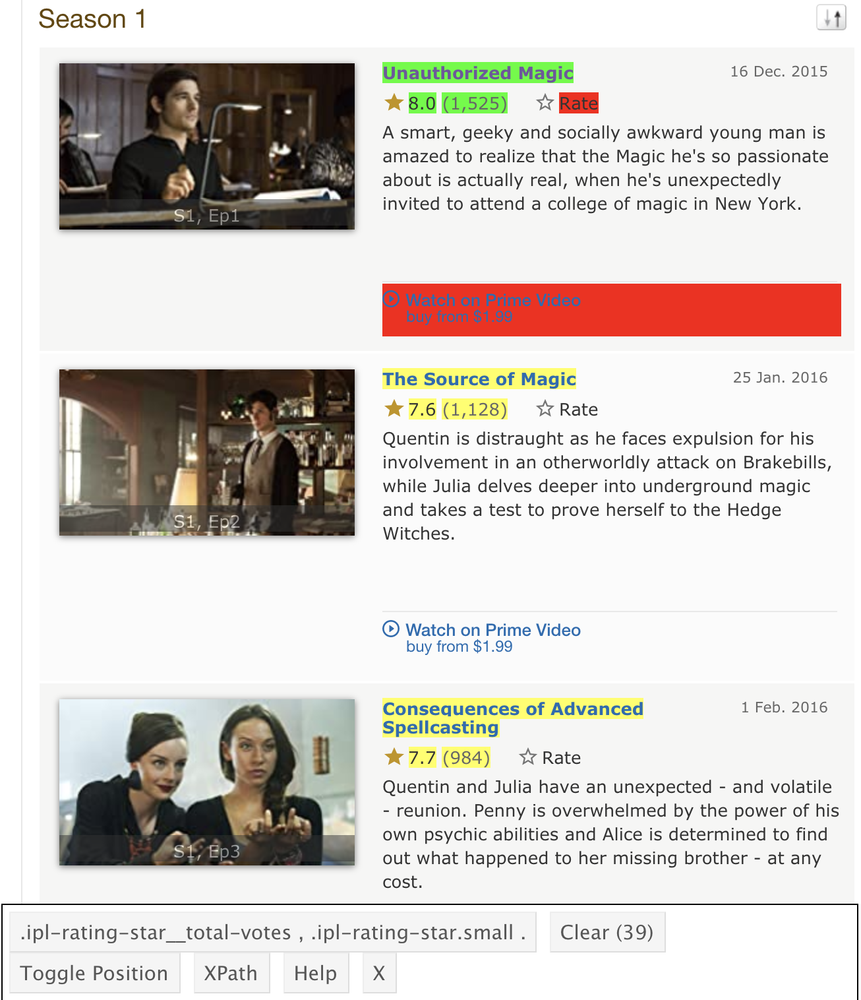

```{r setup, include=FALSE}
knitr::opts_chunk$set(echo = TRUE)
```

I love *[The Magicians](https://en.wikipedia.org/wiki/The_Magicians_(American_TV_series))*. I was in the midst of rewatching this wonderful show recently and as I did, I felt a feeling. This feeling often crops up when rewatching a series or watching a show with someone who hasn't seen it before: it takes a few episodes to reach it's stride. I knew what was going to happen and I latched on to my favorite bits, but it's a different experience on first blush. I remember being quite confused when first watching the series, only to really get into it a few episodes in (maybe it was a whole season?).

This made me curious what other people thought about the show, episode-by-episode. This curiosity took me down a pleasant little rabbit hole, discovering how `rvest` can make easy work of **web scraping in R**.

Let's do some magic with `rvest`!


## Unleash My Inner (rvest) Magician

My basic goal was to grab the IMDb ratings of *The Magicians* for each episode and plot them over time. This turned into a little exercise in how to use [`rvest`](https://blog.rstudio.com/2014/11/24/rvest-easy-web-scraping-with-r/) to get the data.

### Imports

```{r message=FALSE}
library(tidyverse) # cause duh
library(rvest) # for web scraping
library(glue) # for that warm and fuzzy fstring feeling (python-like)

theme_set(theme_light()) # for cleaner plots (David Robinson screencasts are rubbing off)
library(RColorBrewer) # for a nicer set of colors
```

### Explain Yourself

I started out learning the basics of `rvest` from [Rstudio's blog](https://blog.rstudio.com/2014/11/24/rvest-easy-web-scraping-with-r/). Was able to get the ratings quite easily thanks to [`selectorGadget`](https://selectorgadget.com/), a lovely little plugin for selecting what you want to scrape off the html structure by CSS tags (it's my new favorite thing! :heart:). After scraping, I had the ratings as a vector, which I could convert into a tibble.

```{r}
# how I started exploring

# define url
base_url <- "https://www.imdb.com/title/tt4254242/episodes?season=1"

# go get the html
html <- read_html(base_url)

# grab ratings
rating <- html_nodes(html, ".ipl-rating-star.small .ipl-rating-star__rating") %>% 
    html_text(trim = TRUE)

# make a dataframe
df <- tibble(rating)
```

At this point, I could go back and take a bigger bite: grab more stuff from each page and add in a `for` loop to grab data for all seasons. Here's a look at `selectorGadget` in action:



And here's the code I ended up with:

```{r cache = TRUE}
# list of seasons
seasons = seq(1,5)

# empty list to store dataframes
df_list = list()

# lez go!
for (season in seasons) {
  
  # define url, using glue for combining strings
  base_url <- "https://www.imdb.com/title/tt4254242/episodes?season="
  season_url <- glue("{base_url}{season}")
  
  # go get the html
  html <- read_html(season_url)
  
  # isolate the desired data
  title <- html_nodes(html, "#episodes_content strong a") %>% 
    html_text(trim = TRUE)
  rating <- html_nodes(html, ".ipl-rating-star.small .ipl-rating-star__rating") %>% 
    html_text(trim = TRUE) %>% 
    as.numeric()
  votes <- html_nodes(html, ".ipl-rating-star__total-votes") %>% 
    html_text(trim = TRUE) %>% 
    parse_number() # this saved the day! super helpful readr function
  air_date <- html_nodes(html, ".airdate") %>% 
    html_text(trim = TRUE) %>% 
    parse_date("%d %b. %Y")
  
  # make a tibble for each season 
  df <- tibble(air_date, title, rating, votes) %>%
    mutate(season = season,
           episode = seq(1, nrow(.))) %>% 
    select(season:episode, everything())
  
  # add to list
  df_list[[season]] <- df
}

# smoosh the list into one tibble
magicians <- bind_rows(df_list)

```

Some notes:

- **A good flow to know**: The ability to loop through items, make a collection of dataframes, and then combine them is quite useful. I have done this flow a bunch in python, but there were some interesting gear changes in tidyverse-land. My initial thought was to use a dictionary, but I can store them as a `list()` in R, then run `bind_rows()` from `dplyr`. Also found myself writing python-like code, only to realize it needed minor syntax tweaks (stricter `for` loops, for example).
- **Glue is good**: I like [fstrings](https://realpython.com/python-f-strings/) in python, so finding the [glue package](https://cran.r-project.org/web/packages/glue/index.html) was very nice. Makes combining items together easy to understand (comes up more so later).
- **Brittle Code**: Got away with `parse_date()` for `air_date` in this case since *The Magicians* never aired an episode in May. Will come up later.
- **Making columns on the fly**: Adding in the `season` and `episode` columns for each tibble is a nice trick. I know the season given the value in the `for` loop and episode numbers can just come from a sequence counter. Will have to look further into understanding what the period means inside `nrow` in a dplyr chain (references the current object, I guess?)
- **How to select(orGadget)**: I actually isolated each item I wanted separately with `selectorGadget`, but there are probably ways to do it all in one go.

Now we got the data for the show. Let's visualize it!

## Try Some Spells

The results show the average weighted rating of a given episode and how many IMDb users that rating is based on. Episodes of *The Magicians* seem very well-received overall, with an average episode rating of `r round(mean(magicians$rating), 2)` across all seasons. Split by season, the average episode rating has a slight increase in the third season.

```{r message=FALSE}
magicians %>% 
  group_by(season) %>% 
  summarise(avg_rating = mean(rating))
```

Plotting the episodes over time, we can see some interesting results. Going off of ratings, the show seems to "hit it's stride" in the third season, where it had its highest-rated episode. The ratings took the biggest hit with the season four finale, which is quite an eventful one for the show (also interesting how the number of ratings for that episode is bigger than the others). Even so, the worst-rated episode only dips into the low sevens: quite a good run. 

```{r message=FALSE}
magicians_plot <- magicians %>% 
  mutate(season = factor(season)) %>% 
  ggplot(aes(air_date, rating)) +
    geom_smooth(color = "#dddddd", se = FALSE, linetype = "dashed") +
    geom_line(aes(group = season, color = season), alpha = 0.4) +
    geom_point(aes(color = season, size = votes), alpha = 0.4) +
    scale_color_brewer(palette = "Dark2") +
    labs(x = "",
         y = "IMDb Rating",
         size = "# IMDb Users",
         color = "Season",
         caption = "Source: IMBb")

magicians_plot +
  labs(title = "The Source of Magic",
       subtitle = "Weighted Average IMDb Ratings for 'The Magicians'")
```

Here's a look at the progression faceted by season. The progression between seasons is easier to see without the spaces where new episodes weren't airing. The general upward trend is quite steady for the first three seasons, peaking in the 9's then dipping down to the mid to low 8's for the last two seasons (excluding the season four finale). Also can see a high volume of users rating episodes for the earlier seasons, with the final season having the fewest users.

```{r message=FALSE}
magicians_plot + 
  facet_wrap(~ season, scales = "free_x", nrow = 2) +
  labs(title = "No Better to Be Safe Than Sorry",
       subtitle = "Weighted Average IMDb Ratings for 'The Magicians' by Season")
```

## Going (Fillory and) Further

Here are some things that could be cool to explore further about *The Magicians*:

- **Graph Labels**: Labeling the high and low episodes in the graphs above would be a nice touch.
- **Fillory on Ratings**: Is there a jump when the episode centers on [Fillory](https://themagicians.fandom.com/wiki/Fillory)? Might be difficult to find, but could be an interesting note.
- **Characters on Ratings**: Could be interesting to see if ratings map to the characters in the episode. Do ratings dip or spike when certain characters are present?
- **Sentiment Analysis**: Looking at the actual reviews as a sentiment analysis could be another fun rabbit hole.

Stay off the garden path.

## Advanced Spellcasting

Well that's all well and good for *The Magicians*, but I wanted to make it useful for other shows. So let's do some wizaRdry that future-me will be thankful for.

Here I convert the above code into a function that can get data for a show on IMDb for a given stretch of seasons.

```{r}
grab_imdb_ratings <- function(imdb_code, seasons) {
    # Grabbing Rating Data for a show on IMDb
    # 
    # - imdb_code: url code for a given show (the "tt<number_string>" in the url)
    # - seasons: list of desired seasons
  
  # empty list to store dataframes
  df_list = list()
  
  # lez go!
  for (season in seasons) {
    
    # define url, using glue for combining strings
    base_url <- "https://www.imdb.com/title/"
    season_url <- glue("{base_url}{imdb_code}/episodes?season={season}")
    
    # go get the html
    html <- read_html(season_url)
    
    # isolate the desired data
    title <- html_nodes(html, "#episodes_content strong a") %>% 
      html_text(trim = TRUE)
    rating <- html_nodes(html, ".ipl-rating-star.small .ipl-rating-star__rating") %>% 
      html_text(trim = TRUE) %>% 
      as.numeric()
    votes <- html_nodes(html, ".ipl-rating-star__total-votes") %>% 
      html_text(trim = TRUE) %>% 
      parse_number() # this saved the day! super helpful readr function
    air_date <- html_nodes(html, ".airdate") %>% 
      html_text(trim = TRUE) %>% 
      str_remove("[.]") %>%  # remove periods (May doesn't have a period like the rest: Apr., Oct.)
      parse_date("%d %b %Y")
    
    # make a tibble for each season 
    df <- tibble(air_date, title, rating, votes) %>%
      mutate(season = season,
             episode = seq(1, nrow(.))) %>% 
      select(season:episode, everything())
    
    # add to list
    df_list[[season]] <- df
  }
  
  # smoosh the list into one tibble
  show_run <- bind_rows(df_list)
  
  return(show_run)
  
}
```

And here it is in action:

```{r cache=TRUE}
# simpsons, first ten seasons, plus thirteenth for good measure
grab_imdb_ratings("tt0096697", c(1:10, 13))
```


Interesting changes:

- **Sticks together like glue**: Defining the url is a little more complicated, but `glue` makes it easy to work with.
- **A corner case**: For `air_date`, I realized after testing that my previous method broke for the month of May. This was because I assumed all months had a period after them, but May does not have one. This went undetected since *The Magicians* doesn't air any episodes in May. After running a test with *The Simpsons*, I went back and removed the period before parsing. No more `NA`s! (the code is probably brittle in other ways. Tread lightly!)

Huzzah! Now I can use it for other projects. Won't that be funzies!

Till next time!


## Learning (There Will be a Quiz)

- The desire for fstrings was filled nicely with the `glue` package.
- Functions and `for` loops feel a little foreign in R right now. Practice, practice, practice.
- I'm a big fan of the ability to execute single lines in a `for` loop with `Cmd-Enter`. Can execute looping code line-by-line to make sure everything is going smoothly.
- Regarding parsing the votes: `str_extract("\\d+")` sort of worked, except for commas when there were a bunch of reviews. `parse_number()` from `readr` to the rescue. Would want to understand further how it behaves in corner cases.
- Using `selectorGadget` is lovely
- Dumb note: I only recently got `rvest` as a package name.
  - Recreation: Ohhhhhh! Cause it's harv—I get it. So the [hex sticker for `rvest`](https://github.com/rstudio/hex-stickers/blob/master/thumbs/rvest.png) has a scythe caus—gotcha. 

## Some References

- [rvest on tidyverse](https://rvest.tidyverse.org/)
- [rvest RStudio Blog Post](https://blog.rstudio.com/2014/11/24/rvest-easy-web-scraping-with-r/)
- [Datanovia Color Palette Post](https://www.datanovia.com/en/blog/top-r-color-palettes-to-know-for-great-data-visualization/)

#### Image Credit
[soybean](https://thenounproject.com/zachbogart/collection/field-crops/?i=2700664) by Zach Bogart from [the Noun Project](https://thenounproject.com/)
