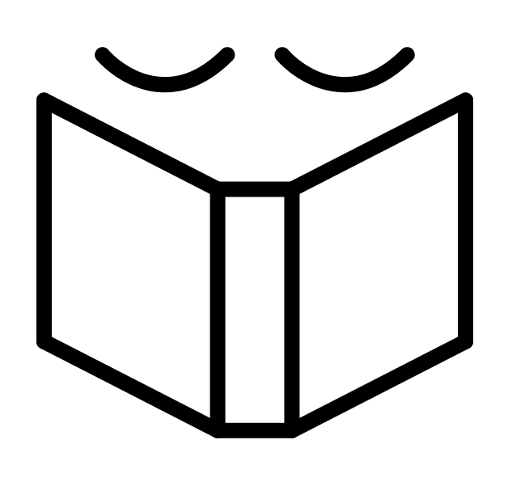

<!-- Icon Image: Small -->
 

This is an Observable Notebook of things I'm reading. 

It's embedded below, though it's easier to [view on Observable](https://observablehq.com/@zachbogart/bookworm-v1).

📚⏳✅

📖

<iframe width="100%" height="500" frameborder="0"
  src="https://observablehq.com/embed/@zachbogart/bookworm-v1?cell=*"></iframe> 

<!--Noun Image Credit-->
#### Image Credit
[Reading](https://thenounproject.com/search/?creator=4129988&q=book&i=3169936) by Zach Bogart from [the Noun Project](https://thenounproject.com/)