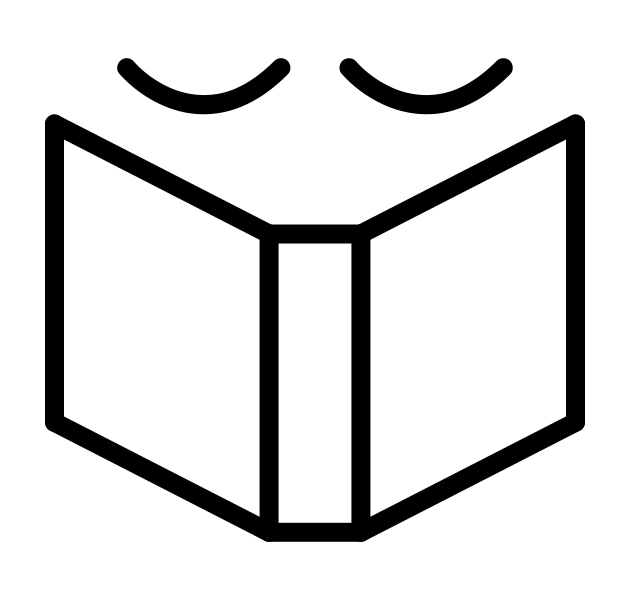

<!-- Icon Image: Small -->
 

This is an Observable Notebook of things I'm reading. 

It's embedded below, though it's easier to [view on Observable](https://observablehq.com/@zachbogart/bookworm).

<iframe width="100%" height="500" frameborder="0"
  src="https://observablehq.com/embed/@zachbogart/bookworm?cell=*"></iframe> 
  
If you enjoy this, feel free to fork it and track your own reading habits (or whatever else). And if you think [this little project deserves a coffee](https://ko-fi.com/zachbogart), I'd welcome the gesture. It's most likely going towards a hot cocoa or a tea, but it'll certainly be paired with whatever happens to be my current readie. Much appreciated. ☕

Happy reading...

📚

<!--Noun Image Credit-->
#### Image Credit
[Reading](https://thenounproject.com/search/?creator=4129988&q=book&i=3169936) by Zach Bogart from [the Noun Project](https://thenounproject.com/)