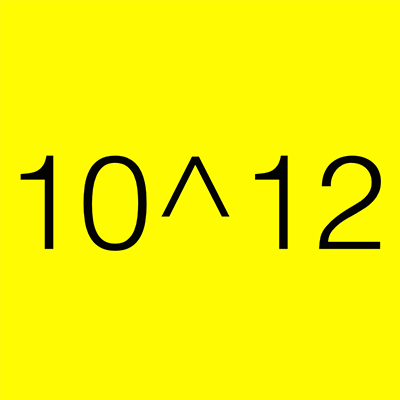
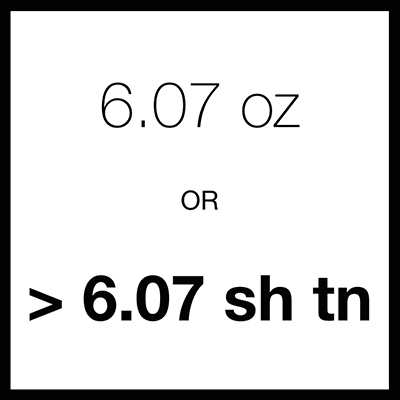

---
title: (Extra)ordinary
summary: Twitter account of what's interesting in the ordinary
subtitle: Trying to write down curiosities
tags:
- archived_project
date: "2015-06-18"

image:
  placement: 1
  focal_point: Smart
  preview_only: false
  
links:
- icon: twitter
  icon_pack: fab
  name: '@synapsnap'
  url: http://www.twitter.com/synapsnap
--- 

The ordinary made extraordinary.

This project uses Twitter to explore what is interesting and extraordinary about ordinary things. Each tweet is somehow related to an ordinary thing (included as a hashtag). My hope is that these tweets, in some small way, keep you feeling interested and excited about the world we live in.

Stay Curious.

{}

<a class="twitter-timeline" data-theme="light" data-link-color="#f4ca16" href="https://twitter.com/synapsnap">Tweets by synapsnap</a> 

# Longer Posts

## 001 Birth

When a human comes into the world, it lets everyone know it’s here. A newborn takes its [first breath of air](https://www.nlm.nih.gov/medlineplus/ency/article/002395.htm) and quickly turns that air into squeals. There is auditory confirmation of this new life transitioning from two very different environments. In the environment it begins its life in, the fetus breathes liquid rather than air in the form of [amniotic fluid](https://www.nlm.nih.gov/medlineplus/ency/article/002220.htm). During labor, the lungs expel the fluid by [some remarkable mechanisms](https://ac.els-cdn.com/S0146000506000073/1-s2.0-S0146000506000073-main.pdf?_tid=54dbc372-0436-11e5-9294-00000aacb35f&acdnat=1432706890_439369b2a8ab8a7a197be59466c25e99). Studies suggest that the hormone [epinephrine mediates the absorption](https://books.google.co.nz/books?id=cdnRMEiIJ0cC&pg=PA115&lpg=PA116&dq=pediatrics+textbook+transition+to+air&source=bl&ots=6te1354Oov&sig=OORCCuiyJhAqmSTln7HcrjAIYa8&hl=en&sa=X&ei=nF9lVZH9NcOB8QXvrYCQAw&redir_esc=y#v=onepage&q&f=false) of the liquid in the lungs, allowing for the lungs to transition to inhaling and exhaling air. It is truly an amazing transformation. A miracle of childbirth.

And this miraculous transition is happening all the time. On the global scale, the birthrate is about [4.3 births every second](http://www.indexmundi.com/world/birth_rate.html). So every second, about four humans make this transition from fluid to air. It works out to about 255 births per minute. For something to relate to, the opening baseline rhythm to the song [In Motion](https://youtu.be/Yczul_609Gg?t=1s) is about 255 BPM:

Birth, Birth, Birth, Birth, Birth, Birth, Birth, Birth, Birth, Birth, Birth, Birth, Birth, Birth, Birth, Birth...

Beats per Minute or Births per Minute. Your choice.

Then there is the amount of time it takes to make all of those babies. For every note in that song opening, a mother has finished spending about [9 months](https://www.wolframalpha.com/input/?i=human+duration+of+pregnancy) building this new person. That is an astonishing amount of effort. And people take notice. The whole community around you welcomes this new life. It is a celebration. When a human comes into the world, it lets everyone know it’s here.

But what about *blogs*? What does a *blog* do when it comes into the world?

When a blog comes into the world, it doesn’t make a sound. It's like a modern twist on the [old philosophical thought experiment](https://en.wikipedia.org/wiki/If_a_tree_falls_in_a_forest) about the tree falling in the forest.

A blog’s birth is silent.

It also seems far less miraculous. In terms of work, with sites like [Wordpress](https://wordpress.com/), anyone can have a simple blog in minutes. Minutes! Even starting from scratch, this site only took a day or two to make. There is much less effort involved, but there are still a lot of them. There are about [172,800 blogs created every day](http://www.wpvirtuoso.com/how-many-blogs-are-on-the-internet/). That's 120 blogs per minute (BPM is such a flexible acronym). The blog birthrate is more akin to the baseline rhythm of Ke$ha’s [We R Who We R](https://youtu.be/mXvmSaE0JXA?t=53s):

BOOM, CHUCK, BOOM, CHUCK, BIRTH, CHECK, BOOM, CHUCK...

Hittin’ on dudes…hard.

And finally, people don’t notice new blogs. Yes, there are a bunch made every day, but very few will gain a sizable audience. It takes a lot of work to generate content that people will want to read and share with others. And this blog is no exception. But the amazing thing is, to modify [one of my favorite movie quotes](https://youtu.be/Ih6jcKd7VwU?t=1m14s):

"Not everyone can become a great blogger, but a great blogger can come from anywhere." - [Anton Ego](http://pixar.wikia.com/Anton_Ego) (reviewing a french rat’s blog)

I hope you enjoyed the first in what I hope to be many posts. I hope you thought it was interesting or entertaining or engaging or maybe even all of the above. Most importantly, I hope you found it [bloggable](https://www.google.com/search?q=bloggable&ie=utf-8&oe=utf-8).

Thanks for being a part of this blog’s audience, and I hope you come back again soon...

…hungry for more.

## 002 Photo Famine

Facebook is big. The site has about [1.44 billion](http://www.statista.com/statistics/264810/number-of-monthly-active-facebook-users-worldwide/) monthly active users. Before we go any further, let’s get some sense of scale. Oftentimes I will gloss over numbers like these without fully comprehending the sheer hugeness of their size. So I will repeat to emphasize: 1.44 billion users. With a B.

As a comparison, there are currently about [7.3 billion humans](http://www.worldometers.info/world-population/) in the world. So, the active monthly user population of Facebook is equivalent to about a fifth of the global population.

To put it another way, if you treat the total surface area of the Earth as the global population, the Facebook population would cover a region the size of the [following countries combined](https://en.wikipedia.org/wiki/List_of_countries_and_dependencies_by_area):

- Russia
- Canada
- China
- United States
- Brazil
- Australia
- India
- Argentina
- Kazakhstan
- Algeria
- Democratic Republic of the Congo
- Greenland (Denmark)
- Saudi Arabia
- Mexico
- Indonesia
- Sudan
- Libya
- Iran
- Mongolia
- Peru
- Chad
- Niger
- Angola
- Mali
- South Africa
- Colombia
- Ethiopia

So that is a sizable group.

And above all else, this group is doing one thing: posting photos. Over [a quarter of a trillion photos](http://www.businessinsider.com.au/facebook-350-million-photos-each-day-2013-9) (with a T now) are on Facebook with an additional 350 million being added every day. At these kinds of rates, an interesting question arises:

Can Facebook run out of possible photos to post?

What do I mean by this? Well, photos are split into small partitions call pixels. Given an image size and format, there is a limited amount of real estate and color options for those pixels, making the number of possible images finite. Granted there are a lot options to choose from. But with so many photos being posted, will we exhaust the options anytime soon?

We need to consider the formats of the images being posted. There are [all sorts of image file formats](https://en.wikipedia.org/wiki/Image_file_formats), but let’s simplify things and see if we can look at how many images are possible for a single image file format and constant image dimensions.

Let’s take a look at the PNG file format and the dimensions of a user’s cover photo.

Let’s assume that every cover photo being posted has the same dimensions that perfectly fit the size allowed for cover photos. The [cover photo dimensions](https://www.facebook.com/PagesSizesDimensions/photos/a.214509701989629.48753.214500051990594/606008246173104/?type=1&theater) for the desktop are 851 x 315 pixels. So, each cover photo contains 268,065 pixels that can each be a different color.

[The PNG file format](https://en.wikipedia.org/wiki/Portable_Network_Graphics) supports several color palettes, but we will consider 24-bit. This means that the color values for each pixel are represented by a 24-bit number, allowing for 16,777,216 different color values per pixel. Multiplying through gives us:

16,777,216 color values per pixel ^ 268,065 pixels

≅ 10^(1,936,694) possible PNG cover photos

That is huge.

And it would be a curious collection of images. It would have every imaginable image that could fit within its boundaries. The Mona Lisa. The Mona Lisa with red hair. Screenshots of every corner of the globe. Pictures of every human living and dead. Pictures of you doing everything you have done in your entire life. Every word printed in every font and in every color and in every orientation. It would be all-inclusive. It would be like the visual version of pi. A Google Street view for the entire history of recorded and to-be-recorded time. It would be spectacular. The amazing thing is although they are huge, the possibilities are not endless. There is a boundary.

We better get posting.

## 003: The Portable Encyclopedia

[Wikipedia](https://en.wikipedia.org/wiki/Wikipedia) is amazing. There are many reasons why (and I hope to cover more reasons in the future), but here we will consider only one. And it is a big one delivered in a small package.

Portability.

Unlike [older encyclopedias](https://en.wikipedia.org/wiki/History_of_the_Encyclop%C3%A6dia_Britannica#Development_of_electronic_versions), Wikipedia was created in the [era of computers](https://en.wikipedia.org/wiki/Information_Age), which brought in a revolutionary change to print as we know it. For the end user, **the content you were reading no longer had to dictate the size of the medium you read it from**. This was not always the case. Physical books (remember those?) do not have this ability. They are restricted by the medium they are printed on and have limited space per page on which to display content. That is why books are thick: they are stacking pages of content on top of each other and the user can flip through each one to view the content. That is also what makes them heavy. With modern technology, this problem disappears.

Now, an entire book can be contained within a device thinner than the book itself. Instead of interacting with stacked sheets of paper, you interact with a single screen that displays the content you want to view. You interact with one page, but that one page can display all of the content you would ever dream of looking at. And the weight now depends on the device, not the content:

- [iPhone 6 Plus weight](https://www.apple.com/iphone-6/specs/): 6.07 oz
- iPhone 6 Plus weight (with Wikipedia): 6.07 oz

So with this revolutionary change, how portable is Wikipedia? Let’s look at the alternative.

Wikipedia is a collection of articles that could be printed, like any other content, as a book. This has been done [in some capacity](http://www.brandnew.uk.com/wikipedia-as-a-printed-book/), but as XKCD pointed out [there would be some problems](https://what-if.xkcd.com/59/). But who cares! Hooray for Hypothetical Land!

What would it look like? It would be quite big. There is, of course, [a Wikipedia article on the subject](https://en.wikipedia.org/wiki/Wikipedia:Size_in_volumes) but the weight is currently missing, which is a crucial question when it comes to portability. So what would it weigh?

This is where we go beyond what physical books can do. [Wikipedia is expanding all of the time](https://en.wikipedia.org/wiki/Wikipedia:Size_of_Wikipedia). This question about the weight of Wikipedia was answered by [Vsauce back in March of 2013](https://www.youtube.com/watch?v=kdrTQlClb08#t=6m11s).

About 7000 pounds.

But since then, Wikipedia has not been sitting still. As of this posting on July 10th, 2015, the Wikipedia size is at 2174 volumes. Assuming each volume is about 4 pounds, that comes out to:

About 8700 pounds.

It has increased by more than 20% of its March 2013 size.

So, in your smartphone, you have access to a collection of knowledge that, in book form, would be getting bigger by about [a volume every other day](https://www.wolframalpha.com/input/?i=400%2F%28march+4+2013+to+today%29) and heavier by [about two pounds a day](https://www.wolframalpha.com/input/?i=1700+pounds%2F%28march+4+2013+to+today%29).

[Widening your jean pockets](http://www.businessinsider.com.au/will-the-iphone-6-plus-fit-into-womens-jeans-pockets-2014-9) is a small price to pay.

## 004 Mondegreens & Mumpsimuses

&

A lot of people know the name of this symbol, but few know where the name comes from. The term [ampersand](https://en.wikipedia.org/wiki/Ampersand) is what is called a *mondegreen* (what a gorgeous word!). A [mondegreen](https://en.wikipedia.org/wiki/Mondegreen) is **a misinterpretation of a phrase as a similar-sounding phrase, usually giving new meaning**. In this case, “ampersand" is a [misinterpretation of the phrase](https://en.wikipedia.org/wiki/Ampersand#Etymology) “and per se and," which means:

“and (as in &) is the word and"

Over time, [it got scrunched](http://blog.dictionary.com/ampersand/) into “ampersand.” Even though it misinterprets the original phrase, ampersand is quite a beautiful word and an [even more beautiful symbol](http://www.webdesignerdepot.com/2010/01/the-history-of-the-ampersand-and-showcase/). It is easily my favorite typographical symbol, and I think the biggest reason for this is [its creative freedom](http://am.persand.me/about/).

There are [so many different kinds of ampersands](http://ampersandampersand.tumblr.com/archive). Some look [like 8’s with twist ties in their sides](http://ampersandampersand.tumblr.com/post/1222376089/charis-sil-regular). Others look more like the original [ligature](https://en.wikipedia.org/wiki/Typographic_ligature) [combining E and T](http://ampersandampersand.tumblr.com/post/833811521/anubis-regular). And still others seem to take [a departure from both extremes](http://ampersandampersand.tumblr.com/post/1222429327/yuki-lined). It is a work of art that is so ubiquitous but there is still room to creatively make it [your own rare gem](http://am.persand.me/060/). It is a very pretty mondegreen.

Most mondegreens, however, are less literary and more lyrical. [Misinterpretation of lyrics](https://www.youtube.com/watch?v=_6jRICTGmnM) is where the mondegreen shines. There is even another name for the phenomenon called [soramimi](https://en.wikipedia.org/wiki/Soramimi). There are [loads of them](http://www.kissthisguy.com/), and you can probably find one you have been singing wrong for years.

You have probably been in the situation where you are driving in a car with someone and they sing the wrong lyrics: a lyrical mondegreen. If you correct them and they still hold their ground with the wrong lyrics, you can tell them they are a *mumpsimus*. [The term](https://en.wikipedia.org/wiki/Mumpsimus) comes from a story of a priest who misread a word as mumpsimus, and when he was told of his error, replied "[I've got so used to using the word mumpsimus that I'll just go on saying it that way.](https://books.google.co.nz/books?id=zHRA_eR0yB4C&pg=PA258&redir_esc=y#v=onepage&q&f=false)" They were told the correct way, but they stuck with their old way of thinking. And this doesn’t just have to apply to lyrics and ampersands: it is about learning from misunderstandings.

I try really hard in life not to be a mumpsimus. There are so many facets to our world and, inevitably, some of our beliefs about how it all works turn out to be mondegreens. We think we understand something but it turns out we are thinking about it all wrong. Maybe you misheard your high school chemistry teachers or misinterpreted a history fact. Maybe you don’t fully understand the significance of a passage in a work of literature. We all go through life with mondegreens littering our brain. We think the world is a certain way. The amazing thing is that [you can find out you were wrong about something](https://www.youtube.com/watch?v=BickMFHAZR0). And it can be totally awesome. You can correct the mondegreens you have in your mind. In those moments of realization, you have a choice:

You can understand how you are wrong and learn from it. You can be amazed that the world is so crazy awesome and keep learning new things. Or you can learn nothing and be a mumpsimus.

Don’t be a mumpsimus.

Stay open to changing your way of thinking. Learn constantly.

Correct your mondegreens.

## 005 Make Change Happen

I’m partial to a [red panda](https://www.bbc.co.uk/nature/life/Red_Panda). Mostly because they are [so darn cute](https://www.google.com/search?q=red+panda+cute&tbm=isch&tbo=u&source=univ&sa=X&ei=jQF1VaHZKonl8gW01oPAAQ&ved=0CB0QsAQ&biw=1387&bih=773). It’s like the cute parts of a cat, a panda, a raccoon, and a bear cub all swirled together. Recently, I had [red pandas](https://en.wikipedia.org/wiki/Red_panda) on my mind so I did what most people nowadays do: I looked it up on the Internet. Amidst all of the short [videos of red pandas](https://www.youtube.com/watch?v=YzVwrvbz_XA), I kept seeing the Google suggestion for ‘red panda documentary.’ This quickly led me to a wonderful little documentary entitled ‘Cherub of the Mist.’

[Cherub of the Mist](https://en.wikipedia.org/wiki/Cherub_of_the_Mist) is about two red pandas that are released into the wild and it follows their challenges trying to find mates and survive. I watched the film. It is a little under an hour long. After I finished it, I was struck by how much work they put into this little film.

The red panda is not the easiest animal to film in the wild. Not to mention there are [very few left in the wild](http://animals.nationalgeographic.com/animals/mammals/red-panda/). So, making a documentary where your sole focus is red pandas is quite the challenge. It took them [2 years to film](http://bedibrothersproductions.com/wildlife-films.php) all of the footage and if you watch the finished documentary, you’ll notice they comment on a lot of things that are ‘firsts of their kind.’ So, they accomplished an amazing feat: they captured footage of an extremely elusive animal that no one had ever captured before and were able to present it to tell an engaging story, all the while raising awareness about endangered species.

It took them about two years. And it took me an hour to watch it. That’s [0.0057%](https://www.wolframalpha.com/input/?i=1hour%2Ftwo+years+as+percentage) of the time it took for them to make it.

This often happens when you create something and present it to the world. **There is a fundamental difference between the time to make something and the time to experience something someone else made.** Let’s call this difference the *Observer Percentage* (or OP for short). For ‘Cherub of the Mist,’ the OP is 0.0057%; the time it took me to experience the documentary is 0.0057% of the time it took for the documentary to be made.

When you make something, it takes a lot of work. You need an idea and you need to plan how you are going to execute it. You need equipment and resources to gather information and understand your topic. And you need to present it to others in an understandable and engaging manner. All of this takes time. A lot of time.

As another example, consider Christian Marclay’s art installation, The Clock. [The piece](https://en.wikipedia.org/wiki/The_Clock_%282010_film%29) is a continuous movie displaying thousands of clips that all relate to the current time of day. So, if you walk inside the viewing room at 4:07 pm, there will be some sort of clip that relates to 4:07 pm. The piece takes its clips from movies, TV shows, and other sources, and it took about three years to complete. Three years of gathering clips and connecting them together, getting the sound right, syncing up the clips with a clock, and [presenting it](https://www.youtube.com/watch?v=Y8svkK7d7sY) as an art installation. It is [a masterful creation](https://www.youtube.com/watch?v=xp4EUryS6ac).

But let’s look at it in terms of Observer Percentages. Even if you went to one of the 24-hour showings, the OP would only be [0.091%](https://www.wolframalpha.com/input/?i=24+hours%2F3+years+as+percentage). When 'The Clock' came to the [Museum of Fine Arts in Boston](http://www.mfa.org/exhibitions/clock-1), I went and watched it for about five hours. So my OP for The Clock is only [0.0019%](https://www.wolframalpha.com/input/?i=5+hours%2F3+years+as+percentage).

This makes me wonder why anyone makes anything. Why put so much time into something someone will experience for only a fraction of the time? Why put so much effort into something that will be experienced so quickly? I think the reason we put so much effort into making things is that during the small amount of time someone experiences your creation, you can affect them in very profound ways.

When you have people experience a creation you have made, you are able to change how they think about all sorts of things. ‘Cherub of the Mist’ exposed me to the difficult challenges that face Red Pandas as well as the general challenge of conservation of endangered species. ‘The Clock’ let me experience time, a constant presence in my life, in a way I had never experienced before. And it doesn’t stop there. There is so much time and effort put into all sorts of aspects of your life.

- Restaurants spend several hours prepping for you to come and eat a meal for 45 minutes ([OP: 10.71%](https://www.wolframalpha.com/input/?i=45+minutes%2F7+hours+as+percentage)).
- Singers spend months perfecting a song you will finish in four minutes ([OP: 0.0015%](https://www.wolframalpha.com/input/?i=+4+minutes%2F6+months+as+percentage)).
- Filmmakers spend years making a story that can be viewed in two hours ([OP: 0.011%](https://www.wolframalpha.com/input/?i=+2+hours%2F2+years+as+percentage)).
- Scientists spend years on experiments only to have people read papers about them in a few hours ([OP: 0.0086 %](https://www.wolframalpha.com/input/?i=+3+hours%2F4+years+as+percentage)).

And even though you may, as an observer, only put in a marginal amount of time or effort, you can be profoundly affected. You can have a very memorable meal. You can relate very deeply and emotionally to a song or film. You can get fascinated by a new scientific discovery. When you make something, you can make change happen. And that is why we will never have a shortage of people making new things, new ideas, new discoveries. The feeling of making change happen is so invigorating. It drives others to make discoveries and inventions. It is wonderful to feel that you have made change happen.

So try in your life to make change happen. And notice the amount of time and effort other people put into making change happen.

It may take a lot of work, but the reward is worth it.

From the initial idea (a post simply about red pandas) to the final presentable product (a post about time, effort, and making things), this post took about 10 days to make.

Considering this post’s word count (about 1000 words) and the average reading speed ([300 words per minute](https://www.google.com/search?q=average+reading+speed&ie=utf-8&oe=utf-8)), the OP for the average reader is about [0.028%](https://www.wolframalpha.com/input/?i=4+minutes%2F10+days+as+percentage). Or 4 minutes.

I hope you had a memorable 4 minutes.

