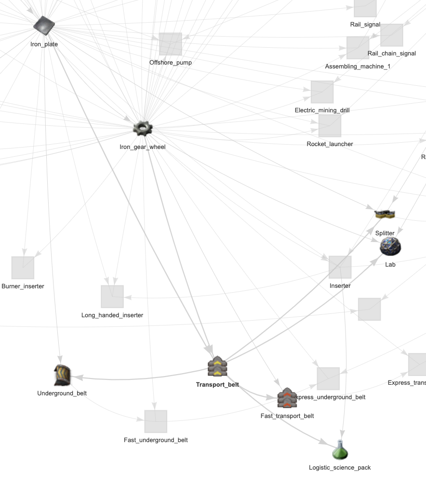

```{r setup, include=FALSE}
knitr::opts_chunk$set(echo = FALSE)
```

```{r message=FALSE}
library(dplyr)
library(visNetwork)
```

```{r warning=FALSE}
connections <- read.csv("connections.csv", header = TRUE)
# items = sort(unique(connections[, "from"]))
from_list <- as.character(connections[, "from"])
to_list <- as.character(connections[, "to"])
# items <- sort(unique(c(from_list, to_list)))

ids <- as.character(connections[, "id"])
ids <- sort(ids[ids != c("")])
groups <- as.character(connections[, "group"])
groups <- groups[groups != c("")]
```

```{r}
path_to_images = "https://wiki.factorio.com/images/"

nodes <- data.frame(id = ids,
                    shape = c("image"),
                    image = paste0(path_to_images, ids, ".png"))
nodes <- nodes %>% mutate(label = id)

edges <- data.frame(
  from = from_list,
  to = to_list
    )
```

```{r}
# ledges <- data.frame(color = c("lightgrey"),
#  label = c("requires"), arrows =c("to"))
```

## Jump In!

*(give it a sec to load)*

Click a node to explore its nearest neighbors. Arrows point toward [increasing complexity](#how-to-understand-the-network). Happy building! 

```{r fig.width=10, fig.height=6}
visNetwork(nodes, edges) %>%
  # visNodes(shapeProperties = list(useBorderWithImage=TRUE)) %>%
  visEdges(arrows = "from", 
           color="lightgrey") %>%
  # visGroups(groupname = "Logistics", color = c("red", "green")) %>%
  # visHierarchicalLayout(direction = "LR") %>%
  visOptions(highlightNearest = TRUE, 
             nodesIdSelection = TRUE) %>%
  visPhysics(solver = "forceAtlas2Based",
             forceAtlas2Based = list(gravitationalConstant = -60),) %>%
  visInteraction(navigationButtons = TRUE, 
                 keyboard = TRUE) %>%
  # visLegend(addEdges = ledges, useGroups = TRUE) %>%
  visLayout(randomSeed = 2) 
```

### Background

[Factorio](https://factorio.com/) is a [management game](https://en.wikipedia.org/wiki/Construction_and_management_simulation) where you survive by building automated systems on an alien planet. The game is built on creating ever more complicated items from simpler building blocks. It can get [quite complicated](https://www.pcgamer.com/see-what-a-factorio-factory-looks-like-after-500-hours-of-work/), but the basic process involves making things that can accomplish tasks and chaining them together. There are a lot of things you can build, and this visualization will let you explore how the items relate to one another in terms of build requirements.

### How to understand the network

The network above shows all items in Factorio (almost; see [Method](#method)) and their build relationships. The item images are the nodes and the arrows are the edges. 

To illustrate how the arrows work, let's highlight the *Transport_belt* node:

{width=500px} 

**Arrows** point in the direction of **increasing complexity**. For example, an arrow between *Iron_gear_wheel* and *Transport_belt* means an *Iron_gear_wheel* can be used to make a *Transport_belt*: 

  - Relationship: An *Iron_gear_wheel* is a **building block** for a *Transport_belt*

Looking at all of the arrows that point **toward** a node shows what items are **required to build** that node:

  - Recipe: A *Transport_belt* uses an *Iron_plate* and an *Iron_gear_wheel* as building blocks

Looking at all of the arrows that point **away** from a node shows what items use that node as a **building block**:

  - Recipe: A *Transport_belt* is used in building an *Underground_belt*, a *Fast_transport_belt*, a *Logistic_science_pack*, a *Lab*, and a *Splitter*

### Interaction

The graph allows for easy navigation and manipulation of the network. Navigation buttons are available as well as Mouse and Keyboard interactions. **Pan** and **Zoom** to orient the graph. Nodes can be **clicked** to highlight nearest connections (direct neighbors, in and out degree) or use the **dropdown menu**. Nodes can also be **dragged** to expose hard-to-see connections.

### Method

Built using the [`visNetwork`](https://datastorm-open.github.io/visNetwork/) package. Images from [Factorio Wiki](https://wiki.factorio.com/) (grateful the wiki organization was so clean, but of course Factorio pros would keep it that way!) Items that only link to themselves—such as Raw_fish or Space_science_pack—were excluded. An arrow only describes a requirement, *not* a quantity; many relationships require multiple items to successfully build. Network contains `r dim(nodes)[1]` nodes and `r dim(edges)[1]` edges.
