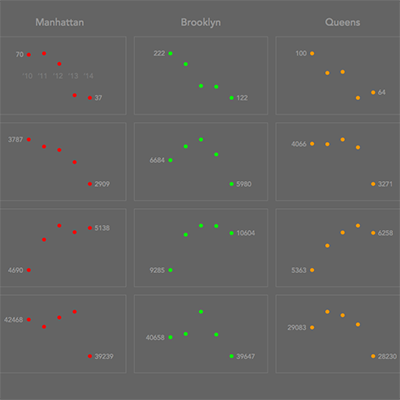

This project will take a look at a small dataset on crime rates between 2010 and 2014 in New York City. I will try to discover what the dataset can tell us, create some sketches, present them, and discuss the results. I will also try to discuss any shortcomings of the results as well as considerations made when making the sketches. This project will evolve over time as I continue to explore the dataset.

## NYC Borough Populations

To begin, I thought I would get a sense of the context of the dataset. Before looking at the crime rates themselves, I’d like to better understand the population distribution of the region. So, I made a sketch showing the average populations of the five boroughs: The Bronx, Brooklyn, Manhattan, Staten Island, and Queens.



I started with the interest in seeing the region itself. I live near New York City, but I didn’t know which borough was which, so I wanted to get a sense of each one in relation to its neighbors. I found a simple [map of the five boroughs](https://commons.wikimedia.org/wiki/File:5_Boroughs_Labels_New_York_City_Map.svg) and used that as the base. Then I averaged the population data I had for each borough and overlaid that on the map as a circle.



At this point it showed the populations but the scales were ambiguous: it wasn’t clear how large the regions were, which borough was which, or what amounts the circles actually represented. After adding some labels & scales and tweaking the colors & sizes, I had a nice sketch of the region of interest.

I think this sketch is an important starting point to the dataset because it helps to put the observer in the mindset of the data that will be presented. From the sketch, we can see that New York City is a very dense region with islands only a few square miles accommodating millions of people. We also notice the separation and population difference between Staten Island and the other four boroughs. From here, we are in a good space to look at the crime rates of the five boroughs.

However, this sketch is not without its faults. I am reducing entire regions to a single number, which can hide nuances underneath the surface. For example, each borough is shown to have a fixed population when, in fact, the data shows every borough’s population has steadily increased from 2010 to 2014. The circles also seem to suggest that the populations are evenly distributed throughout each region, which is clearly false. A simple example is Manhattan, which has a big hole in the middle of it called [Central Park](https://commons.wikimedia.org/wiki/File:NASA_Manhattan.jpg). It also can be difficult to discern the divisions between the boroughs. The narrow strip of land below Brooklyn actually belongs to Queens, and because it’s not under a circle, it seems like it has no population.

The problems with this sketch stem from the fact that very little data is behind the result. It is only based on five values, which quickly leads to observers reading more into the sketch than it can provide. So while it is a good indicator of the region’s population in an abstract sense, it is dangerous to infer too much from this result.

Some important notes:
1. Representing numbers as area must be done carefully. Displaying a value as an area on a map involves a dimensional change, which must be taken into account. One cannot simply use the values as radii; this will cause the circles to represent the population squared, which leads to massive distortions in the data. Take your time and check your math!



2. Building a visualization can blind you from the user’s needs. I was pretty happy with the [unlabeled sketch](images_nyc_crime/nyc_crime_pop_partial1.png) early on, but showing it to someone quickly set me straight. It made sense to me since I had a background in the boroughs and their populations, but it was completely ambiguous to an incoming user. It was not clear which borough was which or what the scale was for the populations. So, make sure you always have the user in mind. They will often not have the background that you have with the data, but if you design it carefully, they won’t need to. The visualization will give them the background they need.

From here, we will look at the crime rates provided in the dataset.

## NYC Crime Rate Trends

Looking at the crime rate data for each borough, I wanted to see how the values changed over time and whether certain crime types were trending up or down. To do this, I plotted the crime rates for the four recorded crime types across all five boroughs. The result was a table of plots showing the [trends in crime rates between 2010 and 2014](crimeRates.pdf).

This graphic began as an interest in plotting trends that show how a value changes over time. So, my first thought went to the stock market. I pulled up the stocks app on my phone and checked the S&P 500.



This became my jumping-off-point for how I wanted to present the data. I wanted to accentuate how the annual crime rate values changed over time and present it like a stock plot, showing the trend and the “opening and closing values” for each time period.

To get a quick sense of how the data would look over time, I tried [plugging the data I had into RAW](http://raw.densitydesign.org/). It quickly became apparent that the difference in scales was going to be a problem. 



A quick test of the murder rates for each borough showed me that plotting all five boroughs on the same graph was going to bias the larger values in the bigger boroughs and make Staten Island’s crime rates look practically constant. Because of this, I decided to separate the types and boroughs into distinct plots, creating a table of twenty cells showing every trend individually. This choice allowed the data to have some breathing room and made it easy to focus on specific trends while also allowing for comparisons between trends.

Before I coded up the plot, I sketched out the plan using a whiteboard (whiteboards are cool). I liked the look, but I was debating what I should use to represent the value itself. I initially liked a horizontal line but that implied that the crime rate was constant for some time, which would be assuming more than the dataset could provide. So, I settled on a simple point and filled in the sketch accordingly. After doing this, I found that I would need to give ample room for the 2010 and 2014 value labels. With the general outline in mind, I wrote a Processing script to plot the table.




The [resulting table of scatterplots](crimeRates.pdf) gives a good sense of how the data changes over the five-year period and how different crimes and boroughs show different trends. This type of graph could be useful in identifying types of crimes that are on the rise and allocating resources in targeted areas to combat them. It also shows how different regions have different criminal environments, suggesting that blanket responses to crime may have negative effects on specific regions. Understanding these differences between regions is the first step to creating an effective response that will do the most good.

### Pitfalls and Stylistic Choices
The biggest problem with this graph is the same problem that plagued the population plot: lack of data. This dataset is very small, which means the “trends” displayed are only based on 5 points each. The graphs are a poor description of crime rate trends in the same way that a stock market graph of a single day is a [poor description of financial trends](images_nyc_crime/crimeRates_badStockAssumption.png). There is insufficient information to draw any sweeping conclusions about what type of crime is rising or falling. A more comprehensive dataset would be needed to back up the trends seen here. Being able to see fluctuations in crime rates at a granular level is a useful tool, but we need more data to work with from the beginning.

Another problem with this graphic is the linear mapping of each trend. Since I chose to split the trends into twenty separate plots rather than overlaying them all on a common graph, the axes could be tailored for each plot. This has its benefits, allowing for smaller numbers not to be pushed to the extremes by the more common ranges of the dataset. However, it also implies relationships that don’t hold up to scrutiny. The linear mapping is based on the ranges of the points involved, meaning a downward trend will look similar regardless of its scale. A trend with a downward tendency on the order of thousands could look identical to a downward trend on the order of dozens. This implies that these trends are identical when they clearly are different beasts. It also means small ranges will have much more volatile trends than larger ranges, evident in the blue plots of Staten Island. So, the compromise is to isolate each plot individually and zoom in on each one to see them fluctuate relative to each other. The tradeoff is the difference in axes is obscured and implies that trends are similar when they are actually separated by orders of magnitude. This ultimately blurs the understanding of what is represented by the y-axis.

One solution to explore in the future is connecting crime rates to populations. In the two graphics created so far, the connections between population and crime rates have been severed, causing problems like boroughs with drastic population differences showing similar crime trends. Factoring in this information will give a more nuanced sense of how different regions have different crime rates and how they change due to population, crime type, and time. Another solution is exploring how all the data could be overlaid on one graph with a logarithmic scale. That said, let’s work with what we have and discuss the choices made creating this graphic.

Since the goal of describing a trend is so open-ended, a lot of stylistic choices need to be made to contain the data and guide the eye. The first consideration was how much data to display. The dataset itself almost serves as a table showing the trends, but it is too much information to view at once. At the opposite end, [a table simply saying that the trend was downward or upward](images_nyc_crime/crimeRates_noPoints.pdf) would describe the dataset, but it would hide too much. The compromise here was to show the trend as a graph but hide some of the values to highlight the shape of the trend rather than the individual values. Of course, the tradeoff was a lot of the data becomes hidden, meaning it is more difficult to see how drastic the changes between years are. In this instance, I wanted to see the progression of the data in the abstract, so obscuring some of the values from the user allowed me to center the focus and reduce clutter. The addition of the “opening and closing values” for 2010 and 2014 brought back some of the granular information of the dataset and provided specific context to those interested in exploring a specific trend.

Additional stylistic choices served to accentuate the trends and guide focus. The x-axis is only provided in the first plot because its information did not need to be [repeated twenty times over](images_nyc_crime/crimeRates_duplicatedXAxis.pdf). Providing it on only one plot with low contrast allows it to be ignored easily, but it’s presence helps to clarify any lingering confusions the user may have about the graphic’s structure. The use of boxes around the cells helps to contain each plot and differentiate between trends. When the [boxes are omitted](images_nyc_crime/crimeRates_noBoxes.pdf), the data seems to drift around and conflict with other trends. Using a low contrast box around each trend extends the tabular structure of the borough columns and crime type rows, making it easier to understand. Finally, the use of color serves as a way to highlight the trends and group them by boroughs. Since the rest of the graphic is in gray scale, the colors catch the eye and draw you immediately into the data. In addition, using color to group by borough made it easy to see the differences between regions. A simple [example with the color removed](images_nyc_crime/crimeRates_noColor.pdf) shows that the lack of color requires the user to keep glancing at the row and column headings to understand what they are viewing. The addition of color allows for unconscious associations between borough and pigment, which means it is easier for the user to understand what each trend corresponds to. By combining boroughs and colors, the user makes an implicit color legend when they view the graphic, making additional clarifications with explicit color legends superfluous.

Future work could help to reduce stylistic problems and obstruction of data by making the graphic interactive. For example, hovering over one of the cells could bring up more detailed information about the values, summary statistics, and whether the trend is linear, exponential, logarithmic, etc. It also could allow broader tailoring of parameters like choosing to view only the Aggravated Assault plots or combining the data with the population plot to get a sense of place. Opening up the data and allowing more abilities to interact with it will lead to a better understanding of what the data can tell you and how it can shape future decision-making and policy changes.

## Concluding Note
Tradeoffs are inherent when you present data. Taking data and presenting it always leads to some part of the dataset becoming hidden, bent, warped, exaggerated, reduced, or corrupted. It is important to understand that every time data is presented, there are compromises that must be made, which take you further and further from the dataset itself. The resulting tradeoffs can make a graphic easier to understand, hide a crucial fact, or even corrupt an entire body of work. So, being aware of tradeoffs is crucial to understanding what a graphic can tell you about a dataset and how it might be biasing or stretching the facts.

## Dataset Stats
- Date Range: 2010–2014
- Average Population Total: 8,330,731

Source: [www.nyc.gov](http://www.nyc.gov/) via [ColumbiaX edX Course](https://www.edx.org/course/statistical-thinking-data-science-columbiax-ds101x-0)